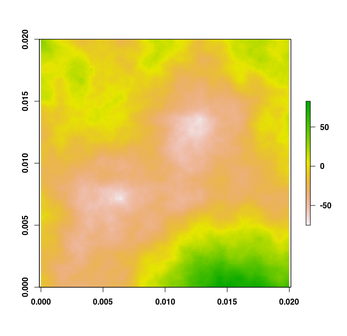
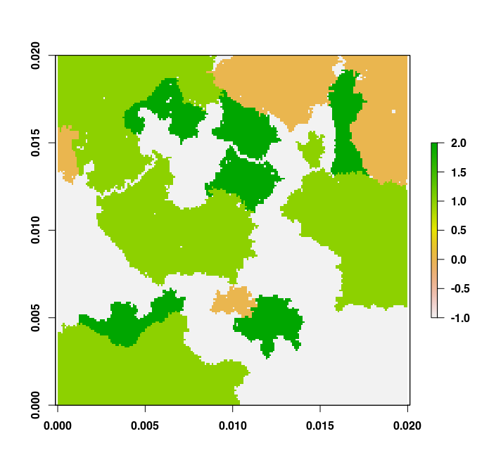

# rflsgen

[](https://github.com/dimitri-justeau/rflsgen/actions/workflows/r.yml) [](https://app.codecov.io/gh/dimitri-justeau/rflsgen) [](https://app.codacy.com/gh/dimitri-justeau/rflsgen/dashboard?utm_source=github.com&utm_medium=referral&utm_content=dimitri-justeau/rflsgen&utm_campaign=Badge_Grade) [](https://doi.org/10.5281/zenodo.5717637) [](https://CRAN.R-project.org/package=rflsgen) [](https://CRAN.R-project.org/package=rflsgen) [](https://www.gnu.org/licenses/gpl-3.0)

`rflsgen` is the R distribution of [`flsgen`](https://github.com/dimitri-justeau/flsgen), a neutral landscape generator that allows users to set targets on landscape indices. It first relies on [Choco-solver](https://choco-solver.org/) to identify landscape structure satisfying user targets, then uses a stochastic algorithm to produce landscape rasters.

  * [Download and installation](#down)
  * [Tutorial](#tuto)
    * [Fractal terrain generation](#terrain)
    * [Landscape structure generation](#structure)
    * [Landscape raster generation](#generate)
    * [Masking](#masking)
    * [Extracting structures from existing landscape](#extract)

## Download and installation <a name="down"></a>

Java 8+ must be installed in your system to run rflsgen. Download and installation instructions for Java are available here: https://www.oracle.com/java/technologies/javase-downloads.html, or here: https://openjdk.java.net/install/. To provide an R interface to flsgen, which is written in Java, rflsgen relies on rJava, which is a dependency of rflsgen and will be installed automatically. If you have any trouble during the installation of rflsgen due to rJava, please refer to rJava's documentation: https://rforge.net/rJava/index.html.

rflsgen is available on CRAN, so you can install it from R using the following command:

```
install.packages("rflsgen")
library(rflsgen)
```

To install rflsgen from Github, you can use the devtools library (https://www.r-project.org/nosvn/pandoc/devtools.html) and use the following commands in R:

```r
devtools::install_github("dimitri-justeau/rflsgen")
library(rflsgen)
```

## Quickstart <a name="tuto"></a>


### Generating a fractal terrain raster <a name="terrain"></a>

You can easily generate a fractal terrain raster using the `flsgen_terrain` function. For example, if you want to generate a 200x200 fractal terrain with default parameters, use the following command:

```r
terrain <- flsgen_terrain(200, 200)
plot(terrain)
```



### Generating landscape structures from targets <a name="structure"></a>

Say that we want to generate a landscape structure for a 200x200 landscape containing three landscape classes (plus a background class), with the following user targets:

| Class | NP      | AREA        | CA           | MESH | PLAND |
| ----- |---------| ----------- |------------- |------| ----- |
| 0     | [1, 10] | [300, 4000] | [1000, 5000] | 225  | -     |
| 1     | [2, 8]  | [200, 4000] |-             |-     | 40%   |
| 2     | [5, 7]  | [800, 1200] |-             |-     | -     |

The first possibility is to create a JSON file (e.g. `target.json`) describing these targets (note that you can also store this json in a string variable):

```json
{
  "nbRows" : 200,
  "nbCols" : 200,
  "classes" : [
    {
      "name" : "Class A", 
      "NP" : [1, 10], 
      "AREA" : [300, 4000], 
      "CA" : [1000, 5000], 
      "MESH" : [225, 225]
    }, 
    {
      "name" : "Class B", 
      "NP" : [2, 8], 
      "AREA" : [200, 4000], 
      "PLAND" : [40, 40]
    }, 
    {
      "name" : "Class C", 
      "NP" : [5, 7], 
      "AREA" : [800, 1200]
    }
  ]
}
```

The second possibility is to use rflsgen helper functions:

```r
cls_a <- flsgen_create_class_targets(
    "Class A",
    NP = c(1, 10),
    AREA = c(300, 4000),
    CA = c(1000, 5000),
    MESH = c(225, 225)
)
cls_b <- flsgen_create_class_targets(
    "Class B",
    NP = c(2, 8),
    AREA = c(200, 4000),
    PLAND = c(40, 40)
)
cls_c <- flsgen_create_class_targets(
    "Class C",
    NP = c(5, 7),
    AREA = c(800, 1200)
)
ls_targets <- flsgen_create_landscape_targets(
    nb_rows = 200, 
    nb_cols = 200,
    classes = list(cls_a, cls_b, cls_c)
)
```

Using the `flsgen_structure` function, you can generate a non-spatially-explicit landscape structure:

```r
structure <- flsgen_structure(targets_file = "examples/targets.json")
```

or

```r
structure <- flsgen_structure(ls_targets)
```

The result is a JSON-formatted string that contains the generated structure. It can be easily converted into a data frame with a dedicated library such as `jsonlite`.

### Generating landscape rasters from landscape structures <a name="generate"></a>

Now, let's generate a landscape raster from the previously generated structure. To do so, we use the `flsgen_generate` function to generate a landscape raster from the previously generated landscape structure:

```r
landscape <- flsgen_generate(structure_str = structure)
plot(landscape)
```



### Masking  <a name="masking"></a>

It is possible to use a mask raster, whose NO_DATA cell will be unavailable for both focal and non-focal classes. To do so, instead of specifying the number of rows and columns in the targets, specify the mask raster with the `maskRasterPath` key:

```json
{
  "maskRasterPath": "mask.tif"
  "classes" : [
    {
      "name" : "Class A", 
      "NP" : [2, 30], 
      "AREA" : [200, 4000], 
      "PLAND" : [40, 40]
    }
  ]
}
```

or:

```r
cls_a <- flsgen_create_class_targets(
    "Class A",
    NP = c(2, 30),
    AREA = c(200, 4000),
    PLAND = c(40, 40)
)
ls_targets <- flsgen_create_landscape_targets(
    mask_raster = "mask.tif",
    classes = list(cls_a)
)
```

### Extracting structures from existing landscapes <a name="extract"></a>

Instead of generating landscape structure from targets, it is also possible to extract existing structures from real landscapes and use them to recreate real composition patterns. To do so, simply use the `flsgen_extract_structure_from_raster` function, indicating the raster values of focal classes:

```r
struct <- flsgen_extract_structure_from_raster("existing_raster.tif", focal_classes=c(0, 1))
```
