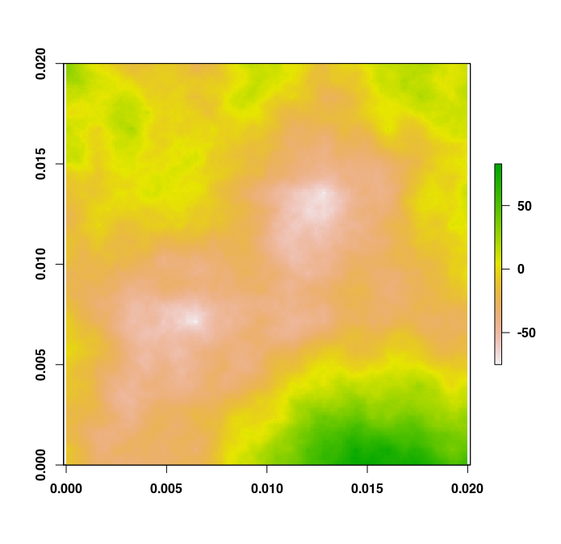
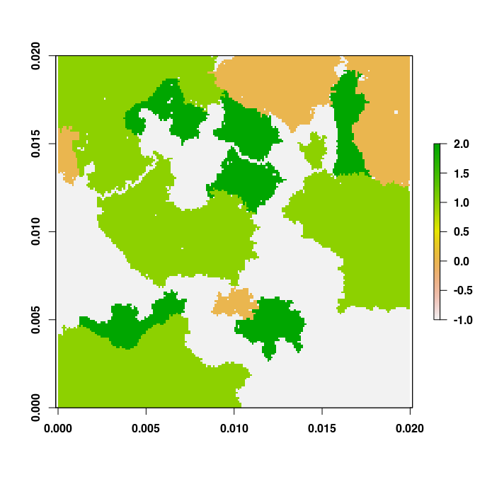

# rflsgen

[](https://github.com/dimitri-justeau/rflsgen/actions/workflows/r.yml) [](https://app.codecov.io/gh/dimitri-justeau/rflsgen) [](https://app.codacy.com/gh/dimitri-justeau/rflsgen/dashboard?utm_source=github.com&utm_medium=referral&utm_content=dimitri-justeau/rflsgen&utm_campaign=Badge_Grade) [](https://doi.org/10.5281/zenodo.5717637)

`rflsgen` is the R distribution of [`flsgen`](https://github.com/dimitri-justeau/flsgen), a neutral landscape generator that allows users to set targets on landscape indices. It first relies on Choco-solver to identify landscape structure satisfying user targets, then uses a stochastic algorithm to produce landscape rasters.

  * [Download and installation](#down)
  * [Tutorial](#tuto)
    * [Fractal terrain generation](#terrain)
    * [Landscape structure generation](#structure)
    * [Landscape raster generation](#generate)

<a name="down"></a>
## Download and installation

Java 8+ must be installed in your system to run rflsgen. Download and installation instructions for Java are available here: https://www.oracle.com/java/technologies/javase-downloads.html, or here: https://openjdk.java.net/install/. To provide an R interface to flsgen, which is written in Java, rflsgen relies on rJava, which is a dependency of rflsgen and will be installed automatically. If you have any trouble during the installation of rflsgen due to rJava, please refer to rJava's documentation: https://rforge.net/rJava/index.html.

To install rflsgen from Github, you can use the devtools library (https://www.r-project.org/nosvn/pandoc/devtools.html) and use the following commands in R:

```r
devtools::install_github("dimitri-justeau/rflsgen")
library(rflsgen)
```

<a name="tuto"></a>
## Tutorial

<a name="terrain"></a>
### Generating a fractal terrain raster

You can easily generate a fractal terrain raster using the `flsgen_terrain` function. For example, if you want to generate a 200x200 fractal terrain default parameters, use the following command:

```r
terrain <- flsgen_terrain(200, 200)
plot(terrain)
```



<a name="structure"></a>
### Generating landscape structures from targets

Say that we want to generate a landscape structure for a 200x200 landscape containing three landscape classes (plus a background class), with the following user targets:

| Class | NP      | AREA        | CA           | MESH | PLAND |
| ----- |---------| ----------- |------------- |------| ----- |
| 0     | [1, 10] | [300, 4000] | [1000, 5000] | 225  | -     |
| 1     | [2, 8]  | [200, 4000] |-             |-     | 40%   |
| 2     | [5, 7]  | [800, 1200] |-             |-     | -     |

The first step is to create a JSON file (e.g. `target.json`) describing these targets:

```json
{
  "nbRows" : 200,
  "nbCols" : 200,
  "classes" : [
    {
      "name" : "Class A", 
      "NP" : [1, 10], 
      "AREA" : [300, 4000], 
      "CA" : [1000, 5000], 
      "MESH" : [225, 225]
    }, 
    {
      "name" : "Class B", 
      "NP" : [2, 8], 
      "AREA" : [200, 4000], 
      "PLAND" : [40, 40]
    }, 
    {
      "name" : "Class C", 
      "NP" : [5, 7], 
      "AREA" : [800, 1200]
    }
  ]
}
```

Using the `flsgen_structure` function, you can generate a non-spatially-explicit landscape structure:

```r
structure <- flsgen_structure(targets_file = "examples/targets.json")
```

The result is a JSON-formatted string which contains the generated structure. It can be easily converted into a dataframe with a dedicated library such as `jsonlite`.

<a name="generate"></a>
### Generating landscape rasters from landscape structures

Now, let's generate a landscape raster from the previously generated structure. To do so, we use the `flsgen_generate` function to generate a landscape raster from the previously generated landscape structure:

```r
landscape <- flsgen_generate(structure_str = structure)
plot(landscape)
```


