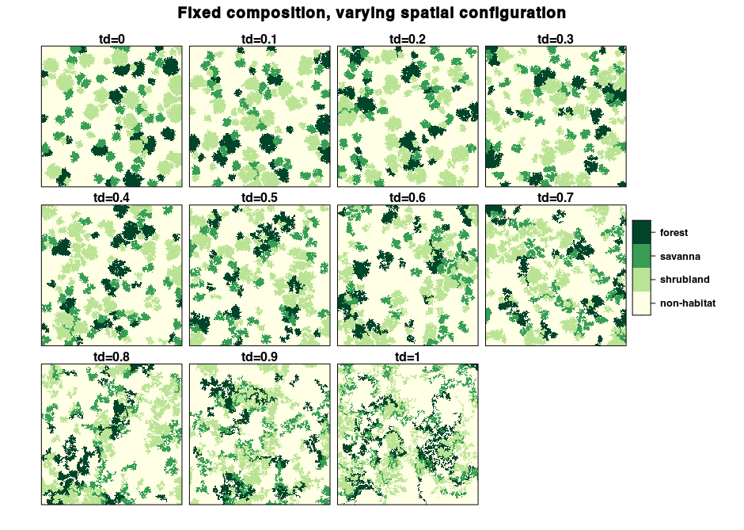
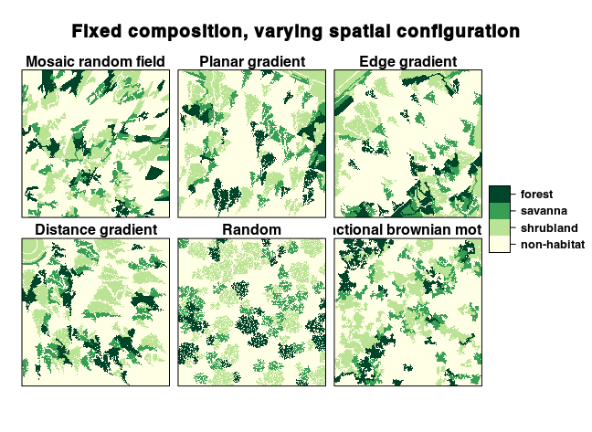

In this use case, we will see how rflsgen can be used to generate a series of landscapes with a fixed composition and varying spatial configurations. First let's load rflsgen:

```{r, warning=FALSE, message=FALSE}
library(rflsgen)
```

## Defining targets for landscape composition

Let's say that, we want to generate 500x500 landscapes composed of three focal land-use classes: shrubland, savanna, and forest. A fourth non-focal land-use class will correspond to areas with no vegetation cover. The first thing we need to do is to define class-level composition targets for our focal classes. We keep it simple and just impose strict constraints on landscape proportion (PLAND), the number of patches (NP), and a looser constraint on patch area (AREA):

| Class     | NP      | AREA         | PLAND |
| --------- |---------| ------------ |------ |
| shrubland | 40      | [500, 3000]  | 20%   |
| savanna   | 30      | [500, 3000]  | 10%   |
| forest    | 20      | [500, 3000]  | 10%   |


We can use a JSON file or string to define these targets:

```{js}
{
  "nbRows" : 500,
  "nbCols" : 500,
  "classes" : [
    {
      "name" : "shrubland",
      "NP" : [40, 40],
      "AREA": [500, 3000],
      "PLAND": [20, 20],
    },
    {
      "name" : "savanna",
      "NP" : [30, 30],
      "AREA": [500, 3000],
      "PLAND": [10, 10],
    },
    {
      "name" : "forest",
      "NP" : [20, 20],
      "AREA": [500, 3000],
      "PLAND": [10, 10],
    }
  ]
}
```

We can also use `flsgen_create_class_targets` and `flsgen_create_landscape_targets` functions:

```{r}
shrubland <- flsgen_create_class_targets("shrubland", NP = c(40, 40), AREA = c(500, 3000), PLAND = c(20, 20))
savanna <- flsgen_create_class_targets("savanna", NP = c(30, 30), AREA = c(500, 3000), PLAND = c(10, 10))
forest <- flsgen_create_class_targets("forest", NP = c(20, 20), AREA = c(500, 3000), PLAND = c(10, 10))
ls_targets <- flsgen_create_landscape_targets(500, 500, list(shrubland, savanna, forest))
```

## Generating a landscape structure

To generate a landscape structure satisfying these targets, we use the `flsgen_structure` methods:

```{r}
structure <- flsgen_structure(ls_targets)
```

This structure is formatted as a JSON string, which can be easily converted to a dataframe using the [jsonlite](https://cran.r-project.org/package=jsonlite) package:

```{r}
structure_df <- jsonlite::fromJSON(structure)
for (i in 1:nrow(structure_df$classes)) {
  cat(paste(structure_df$classes[i,]$name, ":",
            "\n\t number of patches", structure_df$classes[i,]$NP,
            "\n\t smallest patch size", structure_df$classes[i,]$SPI,
            "\n\t largest patch size", structure_df$classes[i,]$LPI, "\n\n"))
}
```

**Note:** There is a `search_strategy` parameter in `flsgen_structure` which indicate to [Choco-solver](https://choco-solver.org/) how to construct its search tree. Although this search strategy does not influence whether the targets will be satisfied or not, it can help diversify the generated structure by exploring the search tree in different ways. Available search strategies in Choco are: `""DEFAULT", "RANDOM", "DOM_OVER_W_DEG", "DOM_OVER_W_DEG_REF", "ACTIVITY_BASED", "CONFLICT_HISTORY", "MIN_DOM_LB", "MIN_DOM_UB"` (please refer to [Choco documentation](https://choco-solver.org/docs/solving/strategies/) if you want more details).

## Generating our first landscape

At this point, we can quickly generate a landscape raster using the `flsgen_generate` method:

```{r}
landscape <- flsgen_generate(structure, verbose = FALSE)
plot(landscape)
```

## Varying spatial configuration

There are three parameters influencing the spatial configuration of produced landscapes in `flsgen_generate`:

- The `min_distance` parameter, defines the minimum distance between any two patches of the same class.
- The `terrain` parameter, is a continuous raster guiding the generation algorithm.
- The `terrain_dependency` parameter, defines to which extent the generation algorithm is influenced by the terrain.

Terrain rasters can either be generated "on-the-fly" by flsgen, which relies on the diamond-square (or midpoint displacement) algorithm or given as input. This last option makes it possible to use continuous neutral landscapes generated with other software packages such as [`NLMR`](https://ropensci.github.io/NLMR/), or even digital elevation models from real landscapes.

Here, we will generate a landscape with various spatial configurations by varying the terrain dependency parameter. We also fix the `roughness` parameter to 0.2 for on-the-fly diamond-square terrain generation and the `min_distance` parameter to 4.

```{r, eval=FALSE}
td_seq <- seq(0, 1, by=0.1)
landscapes <- lapply(td_seq, function(td) {
  flsgen_generate(structure, roughness = 0.2, terrain_dependency = td, min_distance = 4, verbose = FALSE)
})
```

```{r, echo=FALSE,  warning=FALSE, message=FALSE, eval=FALSE}
library(rasterVis)
library(RColorBrewer)
landscapes <- lapply(landscapes, function(r) {
  r <- ratify(r)
  rat <- levels(r)[[1]]
  rat$landcover <- c("non-habitat", "shrubland", "savanna", "forest")
  levels(r) <- rat
  return(r)
})
s <- stack(landscapes)
cols <- colorRampPalette(brewer.pal(9,"YlGn"))
levelplot(
  s,
  scales=list(draw=FALSE), 
  names.attr=paste0("td=", td_seq), 
  col.regions=cols,
  xlab=NULL, ylab=NULL,
  main="Fixed composition, varying spatial configuration"
)
```



Although they look different, all these landscapes have the exact same composition. We can check this using the landscapemetrics package:

```{r, warning=FALSE,message=FALSE, eval=FALSE}
library(landscapemetrics)

# Number of patches for landscape 2 (td=0.1)
np_landscape_2 <- lsm_c_np(landscapes[[2]])
np_landscape_2[np_landscape_2$class > -1,]

# Number of patches for landscape 10 (td=0.9)
np_landscape_10 <- lsm_c_np(landscapes[[10]])
np_landscape_10[np_landscape_10$class > -1,]

# Proportion of landscape for landscape 3 (td=0.2)
pland_landscape_3 <- lsm_c_pland(landscapes[[3]])
pland_landscape_3[pland_landscape_3$class > -1,]

# Proportion of landscape for landscape 9 (td=0.8)
pland_landscape_9 <- lsm_c_pland(landscapes[[9]])
pland_landscape_9[pland_landscape_9$class > -1,]
```

## Using external raster continuous raster gradients

As the `terrain` parameter influences the spatial configuration of produced landscapes, we can use external rasters, from real data or from external software. Here we use [`NLMR`](https://ropensci.github.io/NLMR/) to generate continuous gradients and use them as input for `flsgen_generate`

```{r, warning=FALSE, message=FALSE, eval=FALSE}
library(NLMR)
mrf <- nlm_mosaicfield(500, 500)
plg <- nlm_planargradient(500, 500)
edg <- nlm_edgegradient(500, 500)
dg <- nlm_distancegradient(500, 500, origin = c(20, 20, 20, 20))
rand <- nlm_random(500, 500)
fbm <- nlm_fbm(500, 500)
terrains <- c(mrf, plg, edg, dg, rand, fbm)
landscapes <- lapply(terrains, function(t) {
  flsgen_generate(structure, terrain_file = t, terrain_dependency = 0.8, min_distance = 4)
})
```

```{r, echo=FALSE,  warning=FALSE, message=FALSE, eval=FALSE}
landscapes <- lapply(landscapes, function(r) {
  r <- ratify(r)
  rat <- levels(r)[[1]]
  rat$landcover <- c("non-habitat", "shrubland", "savanna", "forest")
  levels(r) <- rat
  return(r)
})
s <- stack(landscapes)
cols <- colorRampPalette(brewer.pal(9,"YlGn"))
levelplot(
  s,
  scales=list(draw=FALSE), 
  names.attr=c("Mosaic random field", "Planar gradient", "Edge gradient", "Distance gradient", "Random", "Fractional brownian motion"), 
  col.regions=cols,
  xlab=NULL, ylab=NULL,
  main="Fixed composition, varying spatial configuration"
)
```

