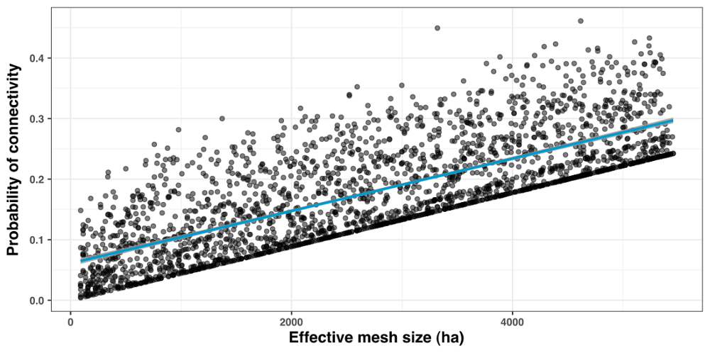

In this use case, we illustrate how rflsgen can help explore correlations between landscape indices. Specifically, we focus on the relation between the effective mesh size (MESH; Jaeger, 2000) fragmentation index and the probability of connectivity index (PC; Saura and Pascual-Hortal, 2007) connectivity index (see [References](#ref) for more details on these landscape indices). Will we generate a series of landscapes where the value of MESH is controlled through targets, for each target value of MESH, we will generate various landscapes with various structures. Then, we will use the [Makurhini](https://connectscape.github.io/Makurhini/) package to evaluate PC on each generated landscape.

## Generating the landscape series

The following code generates ten 500x500 landscapes with a different structure for each target value of MESH between 1000 and 60000 (with a maximum allowed deviation of 1%), with an increment step of 250. Each landscape can have between 1 and 200 patches, and patch areas can vary from 10 to 250000.

**Note:** Although target values are in cell surfaces, we will configure rflsgen to generate landscapes on a projected coordinate system with a 30x30 m resolution. In geographical units, the total extent will be 22,500ha, and MESH will vary from 90 ha to 5400 ha.

First, we prepare the output directories for the generated rasters:

```{r, eval=FALSE}
library(rflsgen)

basepath <- "<the base path for all generated landscapes>"

mesh_seq <- seq(1000, 60000, by=250)
repeats <- seq(1, 10, by=1)

# Clear and create output directories for generated landscapes
lapply(mesh_seq, function(mesh) {
  path <- paste0(basepath, mesh)
  if (dir.exists(path)) {
    unlink(path, recursive = TRUE)
  }
  dir.create(path)
})
```

Then, we define a fuction which generates 10 landscape with varying structures for a given MESH target (see the comments in the code for details):

```{r, eval=FALSE}
meta_generate <- function(mesh) {
  generate <- function(n) {
    # First we create targets for our focal class
    rainforest <- flsgen_create_class_targets(
        "forest",
        NP = c(1, 200), # Number of patches target
        AREA = c(10, 500*500), # Patch area target
        MESH = c(0.99*mesh, 1.01*mesh) # Effective mesh size target
    )
    # Then we create landscape targets
    ls_targets <- flsgen_create_landscape_targets(
        500, 500, # Dimensions of the landscape
        list(rainforest), # Class targets
    )
    # Because we let a high degree of freedom in the landscape structure, it
    # is possible to end up with structures that cannot be spatially embedded.
    # The generation algorithm, as being stochastic, can also fail to embed 
    # structures where the focal class occupy almost all the landscape.
    # To prevent the program from stopping, we let flsgen 20 tries to generate
    # a landscape.
    i <- 0;
    repeat {
      if (i >= 20) {
        stop("fail")
      }
      i <- i + 1
      try({
        # We use flsgen_structure with a RANDOM search strategy to identify a
        # landscape structure satisfying the MESH target
        structure <- flsgen_structure(
            ls_targets,
            search_strategy = "RANDOM",
            time_limit = 60
        )
        # We generate the landscape with flsgen_generate
        result <- flsgen_generate(
          structure_str = structure,
          terrain_dependency = 0.8,
          roughness = 0.35,
          epsg = "EPSG:3163",
          resolution_x = 30,
          output = paste0(basepath, mesh, "/mesh_", mesh, "__", n, ".tif"),
          max_try_patch = 20,
          max_try = 2,
          min_distance = 4
        )
      })
    }
  }
  lapply(repeats, generate)
}
lapply(mesh_seq, meta_generate)
```

**Note:** In `flsgen_structure`, we set the `search_strategy` parameter to `"RANDOM"`. This parameter configures [Choco-solver](https://choco-solver.org/) to randomly construct and explore its search tree, and thus ensure a greater variability in landscape structures. The downside of using a random search strategy is that Choco will not take advantage of the problem structure to build its search tree, there are in consequence fewer guarantees on the run time. This is why we set a limit of 60 seconds, to restart the search if it takes too long. Also, note that the search strategy does not influence whether the targets will be satisfied or not, it just indicates to the solver how to construct its search tree, according to its available strategies, which are: `" DEFAULT", "RANDOM", "DOM_OVER_W_DEG", "DOM_OVER_W_DEG_REF", "ACTIVITY_BASED", "CONFLICT_HISTORY", "MIN_DOM_LB", "MIN_DOM_UB"` (please refer to [Choco documentation](https://choco-solver.org/docs/solving/strategies/) if you want more details).

## Converting rasters into vectors

The [Makurhini](https://connectscape.github.io/Makurhini/) package can compute connectivity metrics on vector datasets. Consequently, we first need to convert our generated landscapes into vectors. There are several ways to do it (e.g. using GIS software such as QGIS, using GDAL, etc). We suggest a rather efficient way to do it with R, relying on the [sf](https://r-spatial.github.io/sf/) and [stars](https://r-spatial.github.io/stars/) packages. 

```{r, eval=FALSE}
library(stars)
library(sf)

lapply(mesh_seq, function(mesh) {
  path <- paste0(basepath, mesh)
  lapply(repeats, function(n) {
    input <- paste0(basepath, mesh, "/mesh_", mesh, "__", n, ".tif")
    output <- paste0(basepath, mesh, "/shape_mesh_", mesh, "__", n, ".shp")
    # Read the raster using stars
    s <- read_stars(input)
    # Set every non-focal cell to NA
    s[[1]][s[[1]] != 0] = NA
    # Convert the raster to vector with sf
    v <- st_as_sf(s)
    st_write(v, output)
  })
})
```

## Computing the probability of connectivity (PC)

We are now ready to compute the PC index on our generated landscapes, and prepare our dataset for the correlation analysis. In the following code, we populate a data frame where each row corresponds to one of our generated landscapes. For each of these, we use [Makurhini](https://connectscape.github.io/Makurhini/) to compute PC (we rely on the default probability threshold method based on the inverse of the mean distance between patches, see Makurhini documentation for more detail), we also use [landscapemetrics](https://r-spatialecology.github.io/landscapemetrics/) to compute the exact MESH value (as we allowed a maximum deviation of 1%).

```{r, eval=FALSE}
library(landscapemetrics)
library(Makurhini)

df <- expand.grid("mesh_target" = mesh_seq, "n" = repeats)
df$file <- paste0(basepath, df$mesh_target, "/shape_mesh_", df$mesh_target, "__", df$n, ".shp")
df$mesh <- sapply(seq(1, nrow(df), by=1), function(i) {
  cat(paste("compute MESH for", i, "\n"))
  path <- paste0(basepath, df[i,]$mesh_target, "/mesh_", df[i,]$mesh_target, "__", df[i,]$n, ".tif")
  lsm_c_mesh(raster(path))[2,]$value
})

df$PC <- sapply(seq(1, nrow(df), by=1), function(i) {
  shape <- st_read(df[i, ]$file)
  if (nrow(shape) == 1) {
    df[i, ]$mesh / (500*500*30*30/10000)
  } else {
    PC <- MK_dPCIIC(
      nodes = shape,
      distance = list(type = "centroid"), 
      metric = "PC", 
      onlyoverall = TRUE, 
      LA =500*500*30*30/10000, 
      area_unit = "ha"
    )
    PC[3,]$Value
  }
})
```

## Plotting the result and evaluating the correlation

```{r, eval=FALSE}
library(ggplot2)

make_fig <- function() {
  point_size <- 1.5
  ggplot(data = df[df$mesh_target <= 60000,]) +
    geom_point(alpha = 0.5, size=point_size, aes(x=mesh, y=PC)) +
    stat_smooth(aes(x=mesh, y=PC), se=TRUE, color="deepskyblue3", alpha=0.8) +
    labs(
      x = expression("Effective mesh size (ha)"),
      y = expression("Probability of connectivity")
    ) +
    theme_bw() +
    theme(axis.title.x = element_text(size = 13, family = "Helvetica"),
          axis.title.y = element_text(size = 13, family = "Helvetica"),
          legend.position="none")
}

make_fig()

cor.test(df$mesh, df$PC, method = c("pearson"))
```



```
	Pearson's product-moment correlation

data:  df$mesh and df$PC
t = 55.602, df = 2368, p-value < 2.2e-16
alternative hypothesis: true correlation is not equal to 0
95 percent confidence interval:
 0.7344983 0.7694578
sample estimates:
      cor 
0.7525077 
```

## References  <a name="ref"></a>

Jaeger, J. A. G. (2000). Landscape division, splitting index, and effective mesh size: New measures of landscape fragmentation. Landscape Ecology, 15(2), 115-130. https://doi.org/10.1023/A:1008129329289

Saura, S., & Pascual-Hortal, L. (2007). A new habitat availability index to integrate connectivity in landscape conservation planning: Comparison with existing indices and application to a case study. Landscape and Urban Planning, 83(2), 91-103. https://doi.org/10.1016/j.landurbplan.2007.03.005


