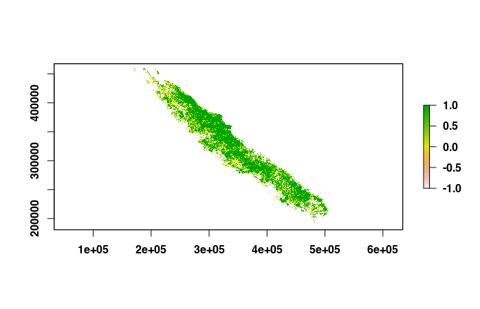
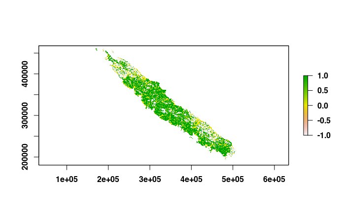
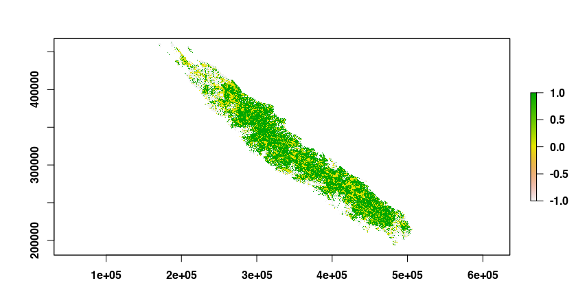

In this use case, we show how rflsgen can be used to extract landscape structures from existing landscapes, and how to recreate neutral landscapes with the same structure, i.e. same composition patterns.

We focus on the forest cover of the main island of New Caledonia, a tropical archipelago located in the South Pacific. Using open data from the Copernicus Global Land Service database (see [References](#ref)), we produced a 105x105 m map with open and closed forest cover in the main island of New Caledonia:

```{r, warning=FALSE, message=FALSE,eval=FALSE}
library(terra)

path <- system.file("extdata",
                    "copernicus_nc_grande_terre_closed_and_open_forests_200m.tif",
                    package = "rflsgen")
existing_landscape <- rast(path)
plot(existing_landscape)
```



To extract the landscape structure, we use the `flsgen_load_structure_from_raster` function:

```{r, warning=FALSE, message=FALSE, eval=FALSE}
# The default memory allocated to the JVM by rJava is 512mb, which will be insufficient
# as the input raster is large (3297x2724). We increase it with the following line.
options(java.parameters = "-Xmx4g")
library(rflsgen)

struct <- flsgen_extract_structure_from_raster(path, c(0, 1),
                                               connectivity = 8)
```

The second argument corresponds to the focal classes raster values (0 is open forest, and 1 is closed forest), and for this use case, we use the 8-connectivity rule.

We then use `flsgen_generate` to recreate a neutral landscape from the extracted structure. We use the digital elevation model of New Caledonia as the continuous environmental gradient.

```{r, warning=FALSE, message=FALSE, eval=FALSE}
dem_path <- system.file("extdata",
                        "dem_nc_grande_terre_200m.tif",
                        package = "rflsgen")
r <- flsgen_generate(struct, terrain_file = dem_path, terrain_dependency = 0.9,
                     epsg = "EPSG:3163", connectivity=8,
                     resolution_x = 105.4308639672429422,
                     resolution_y = 105.4037645741556588,
                     x = 159615, y = 467655)
plot(r)
```


It is interesting to see that the generated landscape has an almost inverted spatial distribution compared to the real landscape. This is not surprising as the forest cover in New Caledonia is known to be positively correlated with the elevation. If we want to generate a neutral forest landscape also positively correlated with the elevation, we just need to use and inverted digital elevation model 

```{r, warning=FALSE, message=FALSE, eval=FALSE}
dem <- rast(dem_path)
values(dem) <- -values(dem)
r <- flsgen_generate(struct, terrain_file = dem, terrain_dependency = 0.9,
                     epsg = "EPSG:3163", connectivity=8,
                     resolution_x = 105.4308639672429422,
                     resolution_y = 105.4037645741556588,
                     x = 159615, y = 467655)
plot(r)
```



**Note:** We used geographical metadata from the original raster to produce a landscape with the same geographical attributes (`epsg`, `resolution_x`, `resolution_y`, `x`, and `y`).

## References  <a name="ref"></a>

Buchhorn, M., Smets, B., Bertels, L., Roo, B. D., Lesiv, M., Tsendbazar, N.-E., Herold, M., & Fritz, S. (2020). Copernicus Global Land Service: Land Cover 100m: collection 3: epoch 2019: Globe (V3.0.1) [Data set]. Zenodo. https://doi.org/10.5281/ZENODO.3939050

